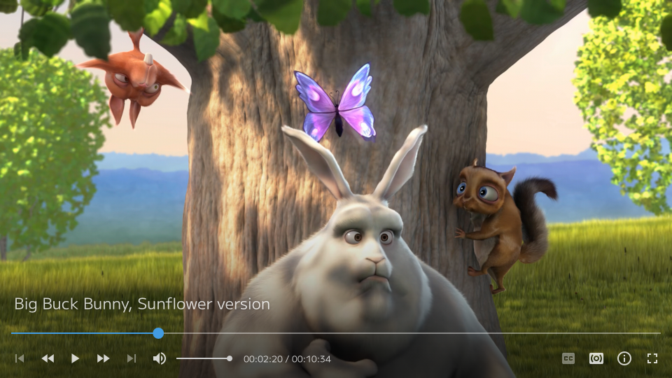

# mpv-osc-youtube-ui

This is a fork of [mpv-osc-modern](https://github.com/maoiscat/mpv-osc-modern).
Differences from upstream are:

- YouTube-like asymmetric UI
- more compact



## Installation

1. Install `youtube-ui.lua` into `~/.config/mpv/scripts`:

```sh
mkdir -p ~/.config/mpv/scripts
wget -P ~/.config/mpv/scripts https://github.com/eatsu/mpv-osc-youtube-ui/raw/main/youtube-ui.lua
```

2. Install `Material-Design-Iconic-Font.ttf` into `~/.local/share/fonts`:

```sh
mkdir -p ~/.local/share/fonts
wget -P ~/.local/share/fonts https://github.com/eatsu/mpv-osc-youtube-ui/raw/main/Material-Design-Iconic-Font.ttf
```

3. Add the following lines to the end of `~/.config/mpv/mpv.conf`:

```conf
osc=no

[Idle]
profile-cond=p["idle-active"]
profile-restore=copy-equal
title=' '
keepaspect=no
background=1
```

4. (optional) Install `thumbfast.lua` from [thumbfast](https://github.com/po5/thumbfast) into `~/.config/mpv/scripts`:

```sh
wget -P ~/.config/mpv/scripts https://github.com/po5/thumbfast/raw/master/thumbfast.lua
```
